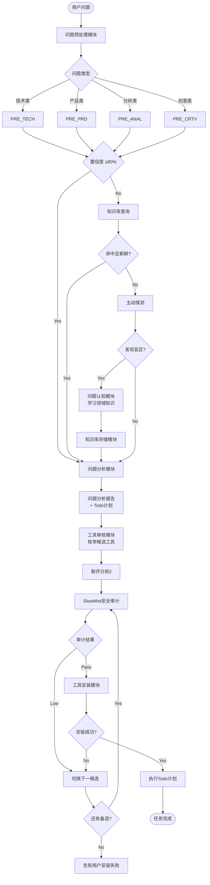
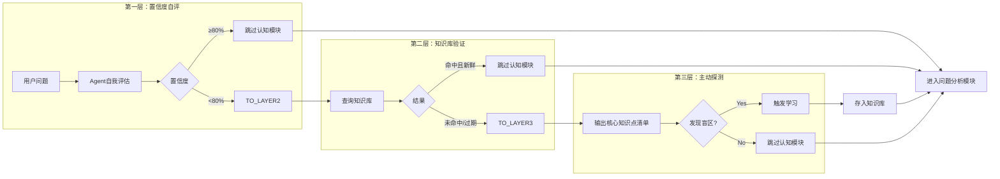
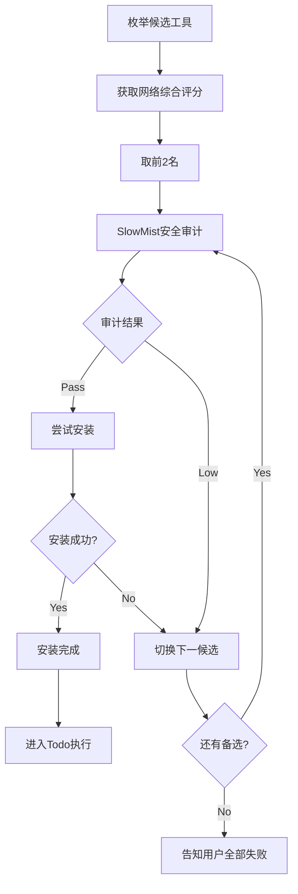
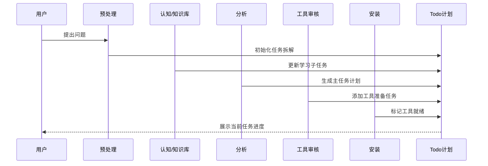

# Agent 问题处理 OS — 完整流程图

> 日期：2026-05-19

## 主流程图

```mermaid
flowchart TD
    START([用户问题]) --> PRE[问题预处理模块]
    
    PRE --> PRE_OUT{问题类型}
    PRE_OUT -->|技术类| PRE_TECH
    PRE_OUT -->|产品类| PRE_PRD
    PRE_OUT -->|分析类| PRE_ANAL
    PRE_OUT -->|创意类| PRE_CRTV
    
    PRE_TECH --> CONF1{置信度 ≥80%}
    PRE_PRD --> CONF1
    PRE_ANAL --> CONF1
    PRE_CRTV --> CONF1
    
    CONF1 -->|Yes| ANAL[问题分析模块]
    CONF1 -->|No| KB_CHECK[知识库查询]
    
    KB_CHECK --> KB_HIT{命中且新鲜?}
    KB_HIT -->|Yes| ANAL
    KB_HIT -->|No| PROBE[主动探测]
    
    PROBE --> BLIND{发现盲区?}
    BLIND -->|Yes| LEARN[问题认知模块<br/>学习领域知识]
    LEARN --> STORE[知识库存储模块]
    STORE --> ANAL
    BLIND -->|No| ANAL
    
    ANAL --> ANAL_REPORT[问题分析报告<br/>+ Todo计划]
    ANAL_REPORT --> TOOL_SEARCH[工具审核模块<br/>枚举候选工具]
    
    TOOL_SEARCH --> SCORE_TOP2[取评分前2]
    SCORE_TOP2 --> SLOWMIST[SlowMist安全审计]
    
    SLOWMIST --> AUDIT{审计结果}
    AUDIT -->|Low| NEXT_TOOL[切换下一候选]
    AUDIT -->|Pass| INSTALL[工具安装模块]
    
    NEXT_TOOL --> MORE{还有备选?}
    MORE -->|Yes| SLOWMIST
    MORE -->|No| FAIL[告知用户安装失败]
    
    INSTALL --> INSTALL_OK{安装成功?}
    INSTALL_OK -->|Yes| DONE[执行Todo计划]
    INSTALL_OK -->|No| NEXT_TOOL
    
    DONE --> END([任务完成])
```

---

## 三层知识探测详细流程

```mermaid
flowchart LR
    subgraph Layer1[第一层：置信度自评]
        Q1[用户问题] --> SELF[Agent自我评估]
        SELF --> CONF{置信度}
        CONF -->|≥80%| SKIP1[跳过认知模块]
        CONF -->|<80%| TO_LAYER2
    end
    
    subgraph Layer2[第二层：知识库验证]
        TO_LAYER2 --> KB_QUERY[查询知识库]
        KB_QUERY --> KB_RESULT{结果}
        KB_RESULT -->|命中且新鲜| SKIP2[跳过认知模块]
        KB_RESULT -->|未命中/过期| TO_LAYER3
    end
    
    subgraph Layer3[第三层：主动探测]
        TO_LAYER3 --> PROBE[输出核心知识点清单]
        PROBE --> GAP{发现盲区?}
        GAP -->|Yes| LEARN[触发学习]
        GAP -->|No| SKIP3[跳过认知模块]
    end
    
    SKIP1 --> FINAL[进入问题分析模块]
    SKIP2 --> FINAL
    LEARN --> STORE_KB[存入知识库]
    STORE_KB --> FINAL
    SKIP3 --> FINAL
```

---

## 工具审核流程

```mermaid
flowchart TD
    TOOL_START[枚举候选工具] --> SCORE[获取网络综合评分]
    SCORE --> TOP2[取前2名]
    TOP2 --> SM[SlowMist安全审计]
    
    SM --> RESULT{审计结果}
    RESULT -->|Pass| TRY_INSTALL[尝试安装]
    RESULT -->|Low| FALLBACK[切换下一候选]
    
    TRY_INSTALL --> INSTALL_OK{安装成功?}
    INSTALL_OK -->|Yes| SUCCESS[安装完成]
    INSTALL_OK -->|No| FALLBACK
    
    FALLBACK --> HAS_MORE{还有备选?}
    HAS_MORE -->|Yes| SM
    HAS_MORE -->|No| FAIL[告知用户全部失败]
    
    SUCCESS --> FINAL[进入Todo执行]
```

---

## Todo 计划模块嵌入位置

Todo 计划模块**贯穿全程**，在以下节点更新状态：

```mermaid
sequenceDiagram
    participant U as 用户
    participant PRE as 预处理
    participant KB as 认知/知识库
    participant ANAL as 分析
    participant TOOL as 工具审核
    participant INSTALL as 安装
    participant TODO as Todo计划
    
    U->>PRE: 提出问题
    PRE->>TODO: 初始化任务拆解
    KB->>TODO: 更新学习子任务
    ANAL->>TODO: 生成主任务计划
    TOOL->>TODO: 添加工具准备任务
    INSTALL->>TODO: 标记工具就绪
    TODO-->>U: 展示当前任务进度
```
