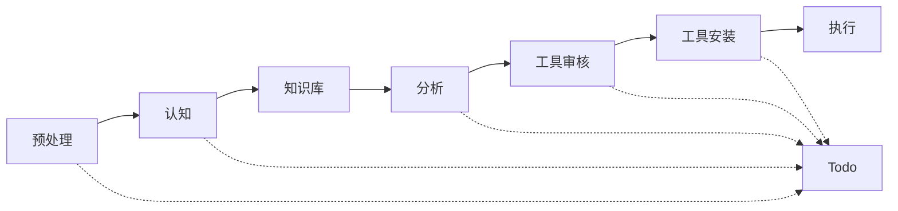

# 七大模块输入/输出/判断逻辑规范

> 日期：2026-05-19

---

## 模块 1：问题预处理模块

### 输入
- 用户原始问题（文本）

### 处理逻辑
1. **问题拆解**：将问题拆分为原子子问题
2. **领域分类**：识别问题所属领域
   - 技术类（编程/开发/运维）
   - 产品类（设计/需求/体验）
   - 分析类（数据/市场/调研）
   - 创意类（内容/文案/设计）
3. **复杂度评级**：简单 / 中等 / 复杂 / 超复杂

### 输出
```json
{
  "original_question": "...",
  "sub_problems": ["子问题1", "子问题2"],
  "domain": "技术类",
  "complexity": "复杂",
  "requires_learning": null
}
```

### 判断逻辑
- `requires_learning` 字段由本模块根据问题类型预设初判，具体是否触发在三层探测后确定

---

## 模块 2：问题认知模块（三层知识探测）

### 输入
- 预处理模块输出
- Agent 自我置信度评估（Agent 主动输出）

### 处理逻辑

#### 第一层：置信度自评
Agent 对每个子问题输出：
```json
{
  "self_confidence": {
    "overall": 75,
    "per_sub_problem": [
      {"sub_problem": "子问题1", "confidence": 90},
      {"sub_problem": "子问题2", "confidence": 60}
    ]
  }
}
```

#### 第二层：知识库验证
查询本地知识库，返回：
```json
{
  "knowledge_hit": true,
  "documents": [
    {"title": "...", "relevance": 0.85, "freshness": "2026-05"}
  ]
}
```

#### 第三层：主动探测
Agent 输出"核心知识点清单"，标记疑似盲区

### 输出
```json
{
  "decision": "进入分析模块",
  "knowledge_gap": ["盲区1", "盲区2"],
  "learning_results": ["学习项1", "学习项2"],
  "context_loaded": true
}
```

---

## 模块 3：知识库存储模块

### 输入
- 问题认知模块的 `learning_results`
- 新学习的知识内容

### 处理逻辑
1. 将知识转为结构化 Markdown
2. 存入对应领域的知识库目录
3. 自动归档旧版本（每月归档）

### 存储结构
```
knowledge-base/
├── 技术类/
│   ├── 编程语言/
│   │   └── python-并发编程.md
│   └── 框架/
│       └── fastapi最佳实践.md
├── 产品类/
└── ...
```

### 输出
```json
{
  "stored_count": 2,
  "locations": ["path/to/doc1.md", "path/to/doc2.md"]
}
```

---

## 模块 4：问题分析模块

### 输入
- 预处理模块输出
- 知识库验证结果
- Agent 专业认知

### 处理逻辑
1. **方法论选择**：根据问题类型选择解决问题的方法论
   - 技术类：结构化调试法 / 重构分析法
   - 产品类：用户故事映射 / 需求优先级
   - 分析类：假设验证法 / 对比分析法
   - 创意类：发散收敛法
2. **深度分析**：对每个子问题进行专业分析
3. **生成 Todo 计划**：输出可执行的任务步骤

### 输出
```json
{
  "methodology": "结构化调试法",
  "analysis": {
    "problem_1": {
      "root_cause": "...",
      "solution_approach": "...",
      "tools_needed": ["tool_A", "tool_B"]
    }
  },
  "todo_plan": [
    {"id": 1, "task": "...", "status": "pending", "depends_on": []},
    {"id": 2, "task": "...", "status": "pending", "depends_on": [1]}
  ]
}
```

---

## 模块 5：工具审核模块

### 输入
- 问题分析模块的 `tools_needed`

### 处理逻辑
1. **枚举候选工具**：每个 needed_tool 找出 3-5 个候选
2. **获取评分**：查询网络综合评分
3. **排序取前2**：按评分降序，取前2名
4. **SlowMist 审计**：调用安全审计 skill
5. **决策**：审计 Pass → 进入安装；Low → 切换下一个

### 输出
```json
{
  "tool_candidates": [
    {"name": "ToolA", "score": 9.2, "audit_result": "Pass", "installable": true},
    {"name": "ToolB", "score": 8.7, "audit_result": "Low", "installable": false}
  ],
  "selected_tool": "ToolA",
  "fallback_tool": null
}
```

---

## 模块 6：工具安装模块

### 输入
- 工具审核模块的 `selected_tool`

### 处理逻辑
1. **下载安装**：执行安装命令
2. **验证可用性**：运行测试命令确认安装成功
3. **失败处理**：尝试 fallback_tool

### 输出
```json
{
  "installed": true,
  "tool_name": "ToolA",
  "version": "1.2.3",
  "fallback_used": false,
  "error": null
}
```

---

## 模块 7：Todo 计划模块

### 输入
- 各模块的状态更新信号

### 处理逻辑
1. **初始化**：问题预处理后生成初始任务列表
2. **更新**：每个模块完成后更新对应任务状态
3. **展示**：向用户展示当前进度

### 状态流转
```
pending → in_progress → completed
                      ↓
                   failed (可重试)
```

### 输出
```json
{
  "total_tasks": 5,
  "completed": 2,
  "in_progress": 1,
  "pending": 2,
  "current_task": {
    "id": 3,
    "task": "安装工具A",
    "status": "in_progress"
  }
}
```

---

## 模块间数据流



**虚线** = Todo 状态更新
**实线** = 数据流向
